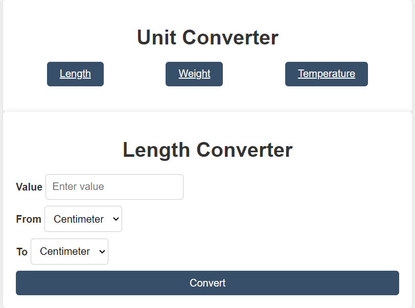

## Features
### Including the following units of measurement to convert between:
- Length: Centimeter, Meter, Kilometer, Foot, Yard, Mile.
- Weight: Gram, Kilogram, Pound.
- Temperature: Celsius, Fahrenheit, Kelvin.

  
## Installation
```bash
git clone https://github.com/nourel25/Unit-Converter.git
```

## Image

